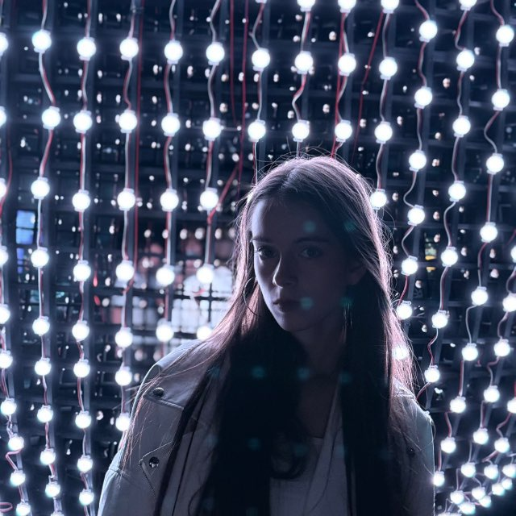

# Обо мне
{: width=250}

## 📚 Образование

- Курс: 1 курс бакалавриата  
- Специальность: Нейротехнологии и программирование  
- Университет: ИТМО

---

## 💻 Технический стек

- Языки программирования Python, C++, SQL
- Web: Django, Jinja2, Bootstrap 5, MkDocs
- Tools: Git, GitHub, Vs Code, Markdown

---

## 🧠 Навыки 

- ✅ Практический опыт с веб-приложениями (например, «Каталог книг»)
- ✅ Реализация CRUD-функционала для сущностей
- ✅ Работа с базами данных через Django ORM

---

## 🎭 Вне учёбы

- Участие в университетской жизни
- Спорт - фитнес
- Высокий уровень владения английским языком

---
