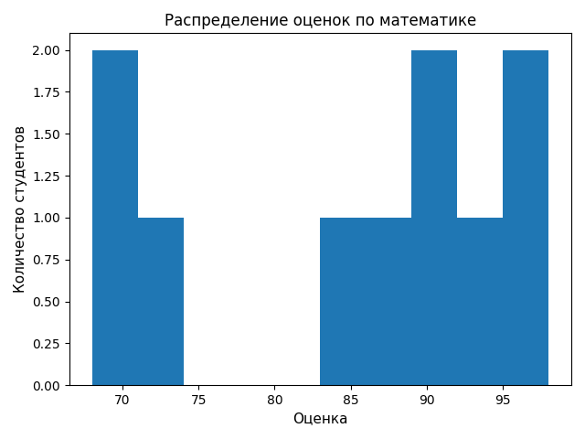
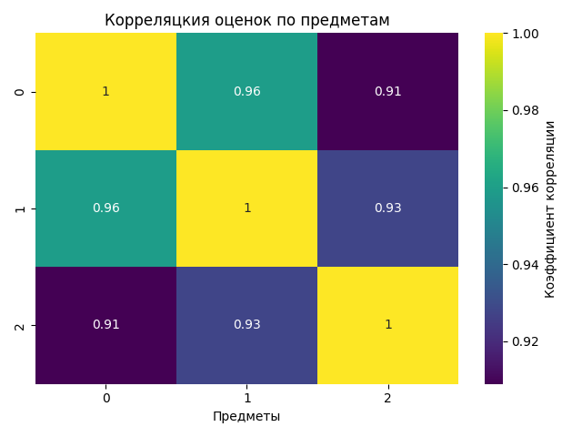
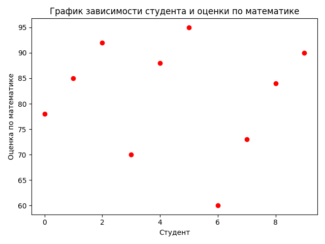
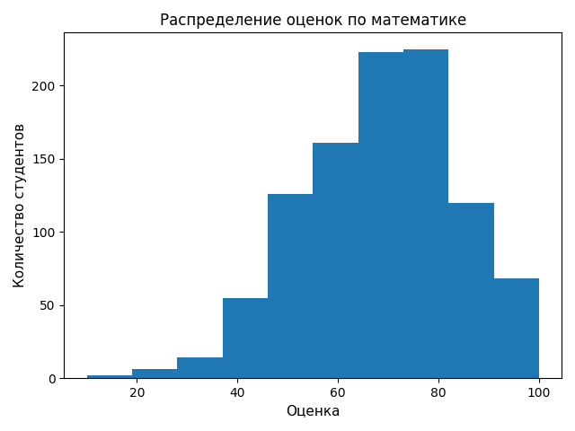
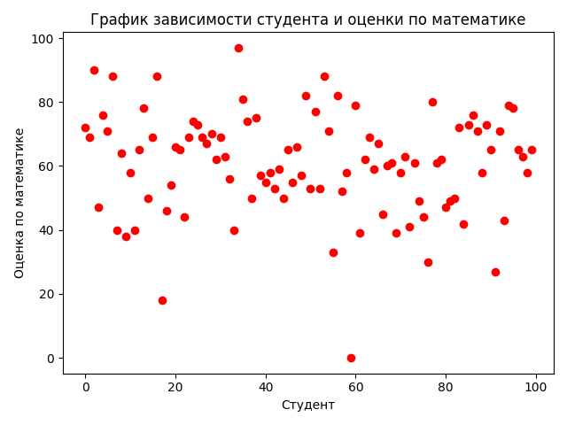

# Лабораторная работа №2

## 📌 Тема
Основы NumPy: массивы и векторные операции

## 🎯 Цели работы
освоить базовые операции векторной и матричной алгебры, методы статистического анализа и визуализации данных с использованием библиотек NumPy, Pandas, Matplotlib.

## Задачи
- Реализовать модуль на Python для работы с массивами данных, включая:
- Освоить базовые операции с массивами в библиотеке NumPy: создание, изменение формы, транспонирование.
- Изучить векторные и матричные операции: сложение, умножение, скалярное произведение, решение систем линейных уравнений.
- Научиться выполнять статистический анализ данных: расчёт среднего, медианы, стандартного отклонения, перцентилей.
- Реализовать нормализацию данных методом Min-Max.
- Освоить визуализацию данных с помощью Matplotlib: гистограммы, тепловые карты, линейные графики.
- Научиться загружать и обрабатывать данные из CSV-файлов с помощью Pandas.
- Закрепить навыки модульного тестирования кода с использованием pytest.

## Как была решена задача?
Для каждой функции написана
- Чёткая сигнатура с аннотациями типов
- Документация в формате docstring
- Достаточная реализация

Написаны тесты для проверки корректности сохранения графиков

## Нюансы
- Тесты для функций, создающих файлы, но ничего не возвращающих
- В csv-файле не все колонки могут быть числовые
- При сравнении результатов вычислений с плавающей точкой необходимо использовать np.allclose() вместо оператора ==, так как особенности представления вещественных чисел в памяти компьютера могут приводить к неустранимым погрешностям округления

## Графики для оценок, предоставленных преподавателем

### Гистограмма распределения оценок по математике

### Тепловая карта корреляции оценок по предметам

### График оценок студентов

---

## Графики для оценок из датасета Kaggle

### Гистограмма распределения оценок по математике

### Тепловая карта корреляции оценок по предметам

### График оценок студентов

## ✅ Выводы
В ходе лабораторной работы были освоены ключевые возможности библиотеки NumPy: создание и преобразование массивов, векторные и матричные операции, статистический анализ. Реализованные функции проходят все тесты, код аннотирован, документирован и оформлен в соответствии с общепринятыми стандартами

## 📁 Репозиторий с кодом
[https://github.com/Lisa15080/Python_projects2/tree/main/numpy_lab](https://github.com/Lisa15080/Python_projects2/tree/main/numpy_lab)

