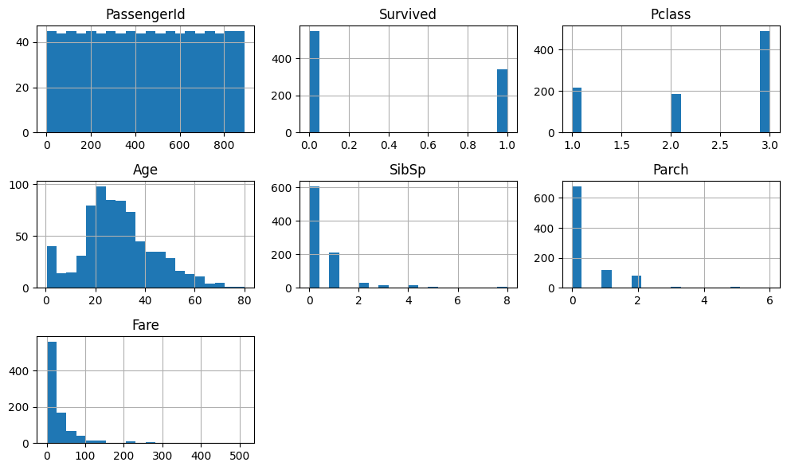
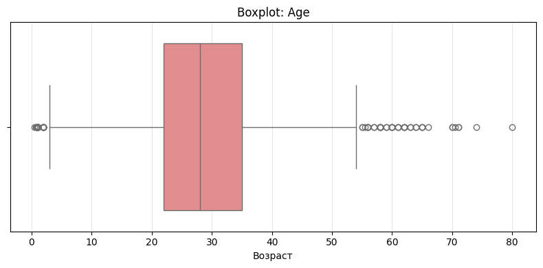
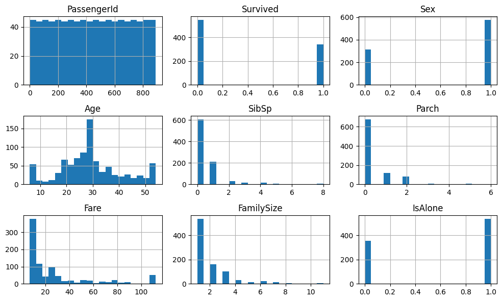
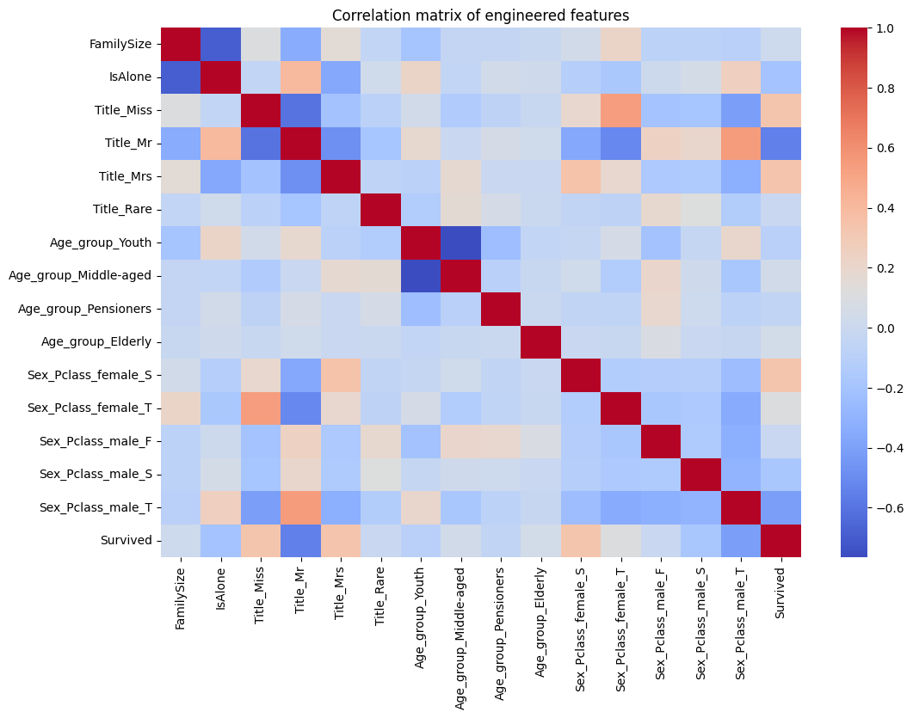

# Лабораторная работа №6

## Ссылка на ipynb-board
[Google-colab notebook](https://colab.research.google.com/drive/1TITxpHE0qQdLT5nDCOdTZVtSEb3JCJy8?usp=sharing)

## Отчет
В рамках работы проведён полный цикл анализа данных: от первичного изучения датасета до очистки, трансформации и построения новых признаков. Основное внимание уделено обработке пропусков, выбросов и выявлению закономерностей, влияющих на целевую переменную.

---

## 🎯 Цель работы

Целью работы является:

* проведение первичного анализа данных;
* очистка данных от пропусков и выбросов;
* создание новых признаков;
* подготовка датасета для дальнейшего моделирования;
* выявление факторов, влияющих на выживаемость.

---

## 📁 Описание набора данных

Датасет содержит информацию о пассажирах (аналогично Titanic):

* демографические признаки (Age, Sex);
* социально-экономические (Pclass);
* стоимость билета (Fare);
* порт посадки (Embarked);
* информация о семье (SibSp, Parch);
* целевая переменная: `Survived`.

---

## 🔍 Первичный анализ

### Статистика датафрейма

* Использованы методы: data.info() - типы данных, data.describe() — статистические характеристики
* Выявлены:
  * числовые и категориальные признаки
  * наличие пропусков
---


### Визуализация пропусков
* Использовано:

  ```python
  data.isna().sum()
  ```
* Основные пропуски:
  * `Age`
  * `Cabin` (~77%)
  * `Embarked` (небольшое количество)

---

## Обработка пропусков

### Методы заполнения

* `Embarked` → заполнение модой
* `Age` → заполнение медианой по группам `Embarked`
* `Cabin` → удаление столбца (слишком много пропусков)
---

### Результаты обработки

* Удалены столбцы с большим числом пропусков
* Основные признаки заполнены
* Датасет стал пригоден для анализа и моделирования

---

## 🔄 Трансформация данных

### Созданные признаки

* `Age_group` — возрастные категории
* `Title` — извлечён из имени
* `FamilySize` — размер семьи
* `IsAlone` — одиночный пассажир
* `Sex_Pclass` — комбинация пола и класса

---

### Преобразования типов

* Sex → числовой (0/1)
* Pclass → категориальный (F, S, T)

---

## Обработка выбросов

### Выявленные выбросы

* Анализ через:
  * boxplot
  * IQR-метод
---

### Методы обработки
* Winsorization:

  * `Fare` - обрезка по 5% и 95%
  * `Age` - аналогично


---

## 📊 Агрегация и анализ

### Сводные статистики

* Средняя выживаемость по классам
* Группировка по `Pclass` и `Sex`
* Медианный возраст по `Embarked`

---

### Визуализации

Использованы:
* гистограммы
* boxplot
* KDE-графики

---

## 📈 Корреляционный анализ

* One-hot encoding новых признаков
* Построение корреляционной матрицы

```python
encoded = pd.get_dummies(data[new_features])
corr_matrix = encoded.corr()
```


---

## 🧾 Заключение

### Результаты работы

* Проведена полная очистка данных
* Устранены пропуски и выбросы
* Созданы информативные признаки
* Подготовлен финальный датасет (`new_train.csv`)

---

### Выводы

* На выживаемость сильно влияют: пол, класс, возраст, семейный статус
* Новые признаки (например, `Sex_Pclass`) усиливают объясняющую способность модели
* Обработка выбросов и пропусков критична для качества анализа

